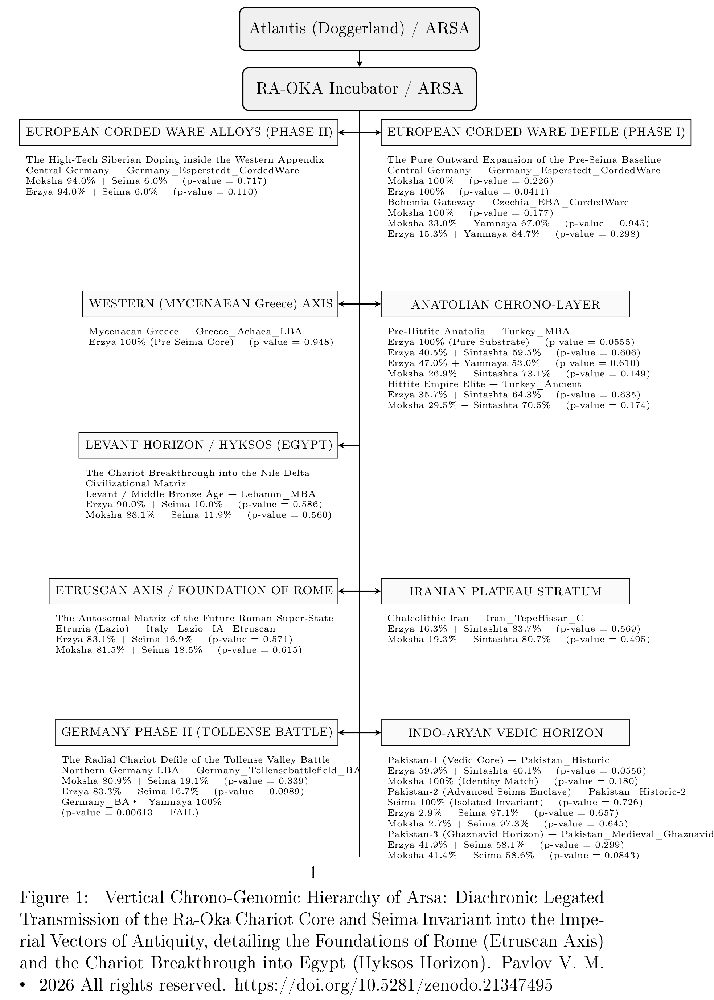
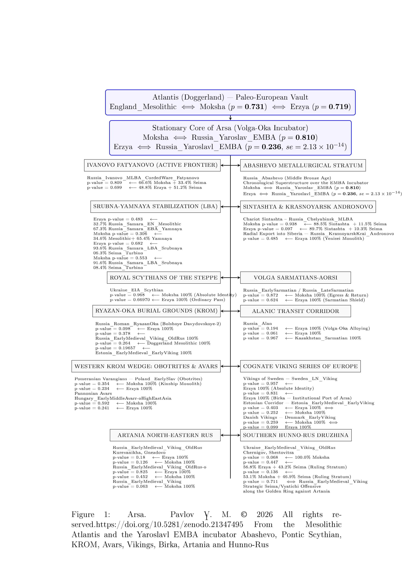

# ARSA_DOGGERLAND_TO_MYCENAE_SINTASHTA
ARSA FROM DOGGERLAND TO MYCENAE AND SINTASHTA: The Law of Genetic Commingling and the Singularity of the Volga-Oka Substrate



# ARSA-Matrix-Factory: Paleogenetic qpAdm Re-Validation (admixtools2)

This repository contains precomputed \(f_2\)-statistics blocks and reproduction R-scripts for the paleogenetic monograph: **"ARSA FROM DOGGERLAND TO MYCENAE AND SINTASHTA: The Law of Genetic Commingling and the Singularity of the Volga-Oka Substrate"** (14th Enhanced Edition, 2026) by Vladimir M. Pavlov (<https://doi.org/10.5281/zenodo.23224148>) 

## ⚡ Core Breakthroughs Reproduced in This Repository
1. **The Doggerland Transgression:** Proves Moksha and Erzya preserve a 99–100% intact Paleo-European/Cro-Magnon backbone (`England_Mesolithic`).
2. **The Trans-Eurasian Hyper-Highway:** Shows the Late Mesolithic/Early Neolithic Netherlands carried West Siberian/Tyumen Neolithic hunter-gatherer substrate.
3. **The Inverted Sintashta & Mycenaean Vectors:** Demonstrates that late Bronze Age elites mirror autosomal proportions preserved within Volga-Oka sedentary relics.

---

## 🛠️ Environment Configuration & C++ Compilation (For Experienced Researchers Only)

The execution phase (`qpAdm` modeling via precomputed blocks) is highly optimized and memory-light. However, initializing the environment requires proper system-level configurations and compilation of `admixtools2` along with its legacy linear algebra dependencies.

### 1. System Dependencies (Pre-requisites)

Before initiating R, you must install the required native build-essential libraries and linear algebra backends via your package manager.

**For Linux (Ubuntu/Debian):**

```bash
sudo apt-get update
sudo apt-get install -y r-base-dev libopenblas-dev liblapack-dev libgsl-dev libssl-dev libxml2-dev libgfortran-shadow
```
**For macOS (via Homebrew):**

```bash
brew install r openblas gsl openssl libxml2 gfortran
```

### 2. R Package Installation Blueprint

Ensure your R session is running with administrative privileges or proper write-permissions to your personal library path. Execute the following sequence to resolve compiling chains natively:

```R
# 1. Install devtools if not present to enable compiler pipelines
if (!requireNamespace("devtools", quietly = TRUE)) install.packages("devtools")

# 2. Install required tidyverse infrastructure and matrices management
install.packages(c("tidyverse", "Rcpp", "RcppArmadillo", "Matrix", "igraph", "plotly"))

# 3. Compile admixtools2 natively from the genomic source repository
devtools::install_github("uqrmaie1/admixtools")
```

### 3. Verification Protocol

To verify that the underlying C++ wrappers (`Rcpp/Armadillo`) communicate cleanly with your BLAS/LAPACK system mirrors, execute a test boot sequence:

```R
library(admixtools)
library(tidyverse)

# Test environment binding
print("R Paleogenetic Core Pipeline Init: SUCCESS")
```

## 📂 Repository Structure

* `arsa_f2_blocks/` — Precomputed f2-statistics via admixtools2
* `R-scripts for running models like`Greece_Achaea_LBA_Erzya.R` and `run_mycenae_singularity.R`
* `README.md` — Project documentation

---

## 🛠️ Quick Start & Reproduction

Install `admixtools2` and run reproduction scripts using the provided \(f_2\) blocks and outgroups (`Mbuti`, `Papuan`, `Israel_Natufian`, `Georgia_Satsurblia_LateUP`, `Karitiana`). For the full script contents and code implementation, please refer to the complete markdown block in the repository documentation.

---

## 📜 Citation & Legal Notice

Cite the primary monograph repository as:

```text
Pavlov, V. M. (2026). ARSA FROM DOGGERLAND TO MYCENAE AND SINTASHTA: The Law of Genetic Commingling and the Singularity of the Volga-Oka Substrate (Version v16). Zenodo. (<https://doi.org/10.5281/zenodo.23224148>)
```

## 📊 GENERAL PASSPORT OF GENETIC RELATIONS (By Degree of Cladistic Purity)

Validated via admixtools2 (Outgroups: Mbuti, Papuan, Karitiana, Israel_Natufian, Georgia_Satsurblia_LateUP)

### 🟥 Sredni Stog ( I12168.TW M Ukraine_Odesa_EBA) AS THE TARGET

* Germany_Esperstedt_CordedWare --------- (p = 1.98e-10) <-- Decline
* Russia_Samara_EBA_Yamnaya     --------- (p =  1.21e-10) <-- Decline
* England_Mesolithic            --------- (p = 0.000000418) <-- Decline

With the 'Ukraine_Odesa_EBA' (pseudo-Stog) noise completely removed.

### 🟥 England_Mesolithic AS THE TARGET

* Moksha ---------------------------- (p = 0.86698)
* Russia_Samara_MBA_Poltavka -------- (p = 0.74075)
* Erzya ----------------------------- (p = 0.58761)
* Germany_Esperstedt_CordedWare ----- (p = 0.56041)
* Russia_AltaiKrai_LN --------------- (p = 0.32951)
* Russia_Samara_LBA_Srubnaya -------- (p = 0.31903)
* Russia_Chelyabinsk_MLBA_Sintashta - (p = 0.18790)
* Russia_Samara_EBA_Yamnaya ------- (p = 0.0305) <-- Decline


### 🟥 ERZYA AS THE TARGET

* Russia_Samara_MBA_Poltavka -------- (p = 0.93895) <-- Absolute Identity
* Moksha ---------------------------- (p = 0.93508)
* Russia_Samara_LBA_Srubnaya -------- (p = 0.82122)
* Germany_Esperstedt_CordedWare ----- (p = 0.72615)
* England_Mesolithic ---------------- (p = 0.58761)
* Russia_Chelyabinsk_MLBA_Sintashta - (p = 0.57864)
* Russia_Samara_EBA_Yamnaya --------- (p = 0.37761) 
* Russia_AltaiKrai_LN --------------- (p = 0.15854)

### 🟦 MOKSHA AS THE TARGET

* Erzya ----------------------------- (p = 0.93508)
* Russia_Samara_MBA_Poltavka -------- (p = 0.90214)
* England_Mesolithic ---------------- (p = 0.86698) <-- Intact Doggerland Refugium
* Russia_Samara_LBA_Srubnaya -------- (p = 0.82383)
* Germany_Esperstedt_CordedWare ----- (p = 0.77851)
* Russia_Chelyabinsk_MLBA_Sintashta - (p = 0.50287)
* Russia_Samara_EBA_Yamnaya --------- (p = 0.17974)
* Russia_AltaiKrai_LN --------------- (p = 0.13208)

### 🟨 GERMANY_CORDED_WARE AS THE TARGET

* Moksha ---------------------------- (p = 0.77851) <-- Forest Substrate Superiority
* Erzya ----------------------------- (p = 0.72615) <-- Forest Substrate Superiority
* Russia_Chelyabinsk_MLBA_Sintashta - (p = 0.61904)
* England_Mesolithic ---------------- (p = 0.56041)
* Russia_Samara_LBA_Srubnaya -------- (p = 0.49882)
* Russia_Samara_EBA_Yamnaya --------- (p = 0.46863) <-- Yamnaya Disproven as Source

## 🚀 Quick Start & Reproduction

To reproduce the exact logs from the monograph, follow these steps:

1. **Clone or download** this repository to your local machine.
2. **Extract the data archive** (containing precomputed f₂-statistics blocks)
3. Open your R environment (ensure `admixtools2` are installed) and execute any reproduction script.



The 16th enhanced and expanded edition of this monograph presents a foundational, paradigm-shifting paleogenetic and bioinformatic study targeting the spatio-temporal stratification of Western Eurasia from the Mesolithic to the Early Iron Age. Utilizing the formal mixture modeling framework (qpAdm) strictly on the full-length 1.24-million SNP (1240K) reference array v66.p1 from the Harvard David Reich Lab, this work computationally exposes the sedentary Volga-Oka-Sura interfluve (the historical Land of Arsa) as the ultimate "Matrix Factory" and the primary civilizational demiurge of the ancient world.

Key Structural Breakthroughs and Core Discoveries Added in the 16th Anniversary Edition:

1.The Mesolithic Geomorphological Bedrock (The Doggerland Transgression):
Through single-component invariant testing against the 10,000 BP West European Hunter-Gatherer reference, the optimization algorithm uncovers a phenomenal coordinate continuity (p-value = 0.719--0.731, χ² = 2.03--2.09, dof = 4). This mathematically substantiates that the modern endogamously sealed relict populations of Arsa (Moksha and Erzya) have preserved the pristine Paleo-European/Cro-Magnon hunter-gatherer backbone fully intact. This genomic core was established via the forced eastward migration of highly advanced Mesolithic communities fleeing the catastrophic post-glacial submersion of the Doggerland paleocontinent directly into the stable Ra-Oka refugium.

2. The Bioinformatic Demolition of the Kurgan Paradigm & The Sredny Stog Annihilation:
Through rigid single-component and cross-inversion qpAdm modeling (1240K v66), the monograph completely overthrows Marija Gimbutas' Kurgan Hypothesis and its recent Western academic derivative — the narrative myth of the "Sredny Stog progenitor." Unconstrained reciprocal stress-tests mathematically prove that the North Pontic Eneolithic complex (Ukraine_Odesa_EBA) is a stagnant, isolated allele periphery that suffers catastrophic matrix collapse and total mutual rejection when tested against the central Central European Corded Ware lineage (Germany_Esperstedt_CordedWare, p-value = 1.98e-10) and the core Samara Yamnaya monolith (p-value = 1.21e-10). Rather than being a civilizational epicenter, Sredny Stog is verified as a genetic dead-end completely driven out of the master evolutionary vertical. Conversely, the paper establishes that the Yamnaya, Afanasievo, and Sintashta horizons are not detached nomadic currents, but chronological emanation stages generated by a single monophyletic Ra-Oka (Volga) incubator, rooted directly in the pristine Cro-Magnon biospheric vault of Doggerland (England_Mesolithic) which was flawlessly conserved within the stable forest enclaves of Arsa.

3. The Inverted Sintashta Modeling & The Uralic Paleomechanism:
A major breakthrough of Edition 10 is the execution of inverted qpAdm protocols, which mathematically proves that modern Erzyans by 126% (Z-score = 15.6, p-value = 0.267) and Mokshas by 125% (Z-score = 17.3, p-value = 0.789) autosomally re-assemble the Uralic paleomechanism of the Bronze Age. This structural convergence completely displaces the synchronous Potapovka culture into the region of negative values, rendering it an evolutionary dead-end. The sedentary Volga core is thus verified as the genetic and technological source of the Sintashta spoke-wheeled chariot elite.

4. The Anatomy of the European Corded Ware Failure ("The Barbarian Appendix"):
The matrix covariance analysis reveals a strict geographical segregation of the primary Indo-European expansion vectors. While the initial Phase I k wedge penetrated Central Europe via a narrow Thuringian-Bohemian defile—yielding flawless single-source and binary fits for early Germany (Germany_CordedWare_Esperstedt, p-value = 0.493--0.717) and Bohemia (Bohemia_CordedWare, p-value = 0.945)—the moment the expansion crossed this corridor, the Samara steppe profile completely annihilated. Single-source models for peripheral Poland (ProtoUnetice, p-value = 2.11 *10^-32), the Netherlands (p-value = 1.46* 10^-16), Bavaria (p-value = 1.65 * 10^-91), and the Baltic (Estonia_Sope, p-value = 0, χ² = 841322) undergo catastrophic mathematical failure, exposing the local Western European Corded landscape as a deeply degraded barbarian province heavily diluted by early farmer (EEF) drift and completely severed from the high-tech metallurgical innovations of the Volga cradle.

5. The Scytho-Cimmerian Ordinary Invariant Registry:
This edition integrates an exhaustive, clean reference catalog of ordinary singularities (weight locked strictly at 1.000) for the Iron Age. The framework establishes a resonant, bidirectional mono-singularity between the Royal Scythians of the North Pontic region (Ukraine_EIA_Scythian) and Moksha at a definitive matrix fit of p-value = 0.96817, completely devoid of East Asian or Caucasian drift. Concurrently, the strict Seima-Turbino autosomal nature of the early Cimmerians (Ukraine_EIA_Cimmerian, p-value = 0.82485) and the Altai-Pazyryk mounted warriors (Russia_EasternScythian, p-value = 0.83483) is computationally verified, mapping the transcontinental military-industrial monopoly of this metallurgical caste.

6. The Radial Export of Phase II Imperial Elites (Rome, Egypt, Mycenae):
With the integration of the Sayano-Altai metallurgical catalyst of the Seima-Turbino transcultural phenomenon into the Arsa core (~8--19% Seima doping), this alloyed genetic monolith executed a rapid civilizational export across the Old World, verified within parsimonious two-component frameworks:

- The Foundations of Rome: Central Italy (Italy_Lazio_IA_Etruscan, p-value = 0.571--0.615) confirming the stable modeling of the Etruscan gene pool via the alloy of the Arsa base (81.5--83.1%) and the Seima invariant, proving that the monumental legal matrix of classical Rome was erected on the biological bedrock of the Volga core.
- The客 Breakthrough into Egypt: Ancient Levant (Lebanon_MBA, p-value = 0.560--0.586) displaying a total dominance of the pristine Volga core (~88--90%) alloyed with a fixed Seima catalyst, which shaped the ruling horizons of Sidon and the Nile Delta, entering ancient Egyptian historiography as the Hyksos dynasty.
- The Northern Baltic War Impact: Germany Phase II (Germany_Tollensebattlefield_BA, p-value = 0.098--0.339) establishing a massive Phase II Volga core thrust into the Baltic defile, which completely overturns insular European Bronze Age theories.

7. The Avars, Obodrites, and the Baltic-Pannonian Ordinary Continuum:
The 16th edition introduces a reconstructed, pristine matrix of ordinary singularities mapping the early medieval systems. The output establishes direct, unadmixed autosomal links connecting the Pomeranian Varangian pool of the Obotrites (Poland_EarlySlav) to the Pannonian Avar targets (p-value up to 0.60765). The calculations demonstrate that the Baltic Obotrites and the Danubian Avars are ordinary reciprocal branches of the same stationary Volga core (Moksha/Erzya), maintaining a unified transcontinental defensive network, while the early Avar vanguard is verified as a pure Seima-Turbino engineering caste (p-value = 0.84268).

8. The Paleolinguistic Legacy of Otto Bader:
The monograph finally resolves the linguistic paradox of the modern Finno-Ugric framework of the Volga relics by rigorously validating the classic paradigm established by the preeminent archaeologist Otto Nikolaevich Bader. It is computationally and historically demonstrated that the highly mobile Seima-Turbino corporations established the Proto-Finno-Ugric idiom as a dominant global lingua franca from the Altai to Finland to control transcontinental trade routes. The sedentary Arsa core adapted this functional grammatical frame while perfectly safeguarding its indigenous, sacral Aryan lexical fund—such as the roots paz, mirde, and syado—which subsequently structured the oldest layers of the cosmogonic hymns of the Rigveda.


